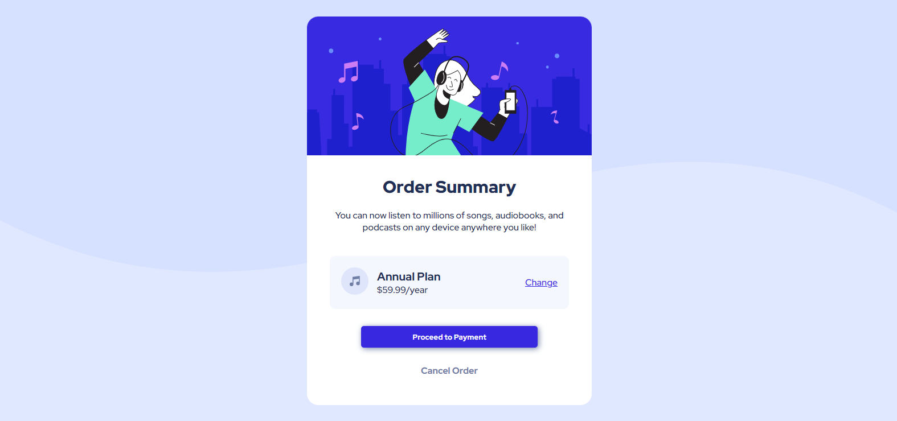

## Table of contents

- [Overview](#overview)
  - [The challenge](#the-challenge)
  - [Screenshot](#screenshot)
  - [Links](#links)
- [My process](#my-process)
  - [Built with](#built-with)

## Overview

### The challenge

- Users should see hover and active states for interactive elements
- Layout should be responsive for smaller size screens

### Screenshot

### Links

- [Live site URL here](https://kamilahareza.github.io/order-summary/)
- [Solution URL here](https://github.com/KamilaHareza/order-summary)

## My process

### Built with
- HTML5
- CSS
- Flexbox
